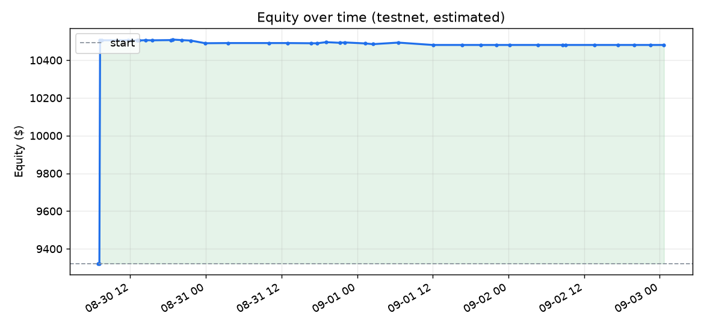

# Bot status  —  updated 2026-09-03 00:41 UTC

💵 **In cash** — no validated edge right now

## Overall
- Equity now: **$10,480.70**  (started $10,000.00)
- Total since start: 🟢 **+4.81%**  _(paper, estimated)_
- Closed trades: **4**  |  wins: **1** (25%)  |  realized P/L: **$480.70**
- Avg slippage vs mid: buy **+0.000%** / sell **+0.002%**  _(over 4 fills)_

## Recent trades
| Exit time | Entry | Exit | P/L % | P/L $ | Why |
|---|---|---|---|---|---|
| 2026-09-01 12:01 | 78621.70 | 77980.80 | 🔴 -1.01% | -10.13 | relearn-exit |
| 2026-08-31 03:29 | 78707.50 | 77706.77 | 🔴 -1.47% | -14.69 | trend |
| 2026-08-30 07:12 | 35843.77 | 78251.30 | 🟢 +118.31% | +1183.13 | target |
| 2026-08-30 06:56 | 124285.94 | 40069.23 | 🔴 -67.76% | -677.61 | stop |

## Equity chart

---
_Paper trading on **live Kraken prices** (simulated fills, fake money). Equity is an internal estimate. This bot adapts but does **not** guarantee profit._